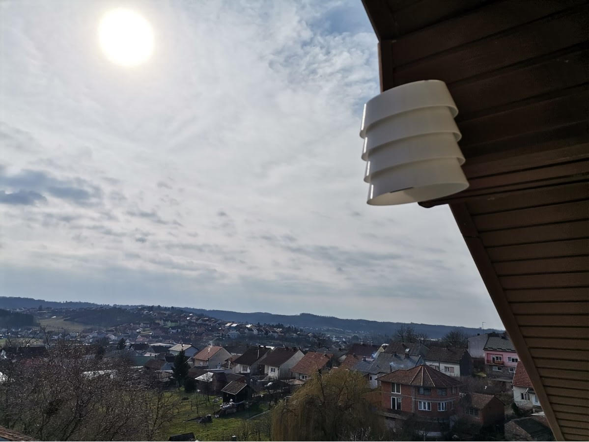
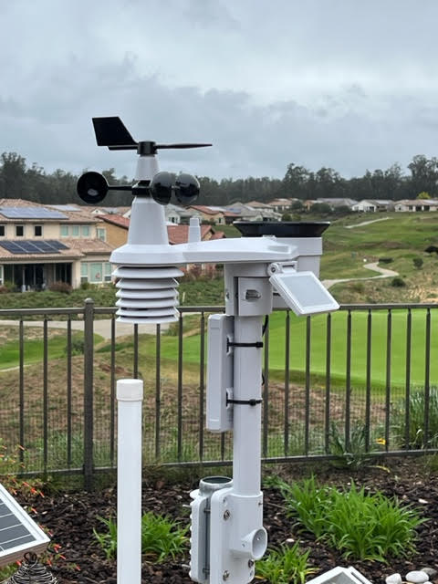
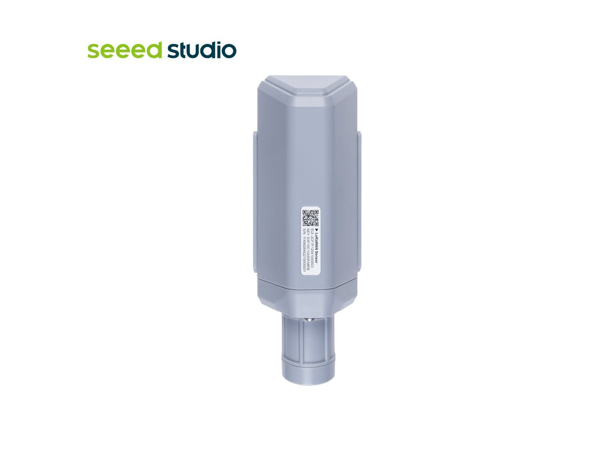
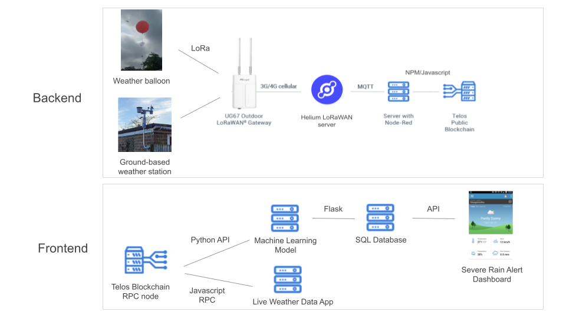

# AscensionWx

A collection of source code and documentation of dClimateIot data-collection solution

AscensionWx is an open source weather station network supporting the Kanda Weather and U.S. and European communities. The hardware ranges from 3D-printed DIY sensors to commercially available weather stations, and aims to improve weather data collection and forecasting. 

## Supported Ground Stations

| 3D-printed AscensionWx     |  SenseCAP LoRaWAN 8-in-1  |  SenseCAP S2101 T+RH sensor |
:-------------------------:|:-------------------------:|:-------------------------:
|   |   |   |

## Web Applications

Live Station Map:

https://app.kandaweather.net

Live station-specific app:

https://ascensionwx-dashboard.vercel.app/graph?devname=brownlotguru

## Engineering Diagram

